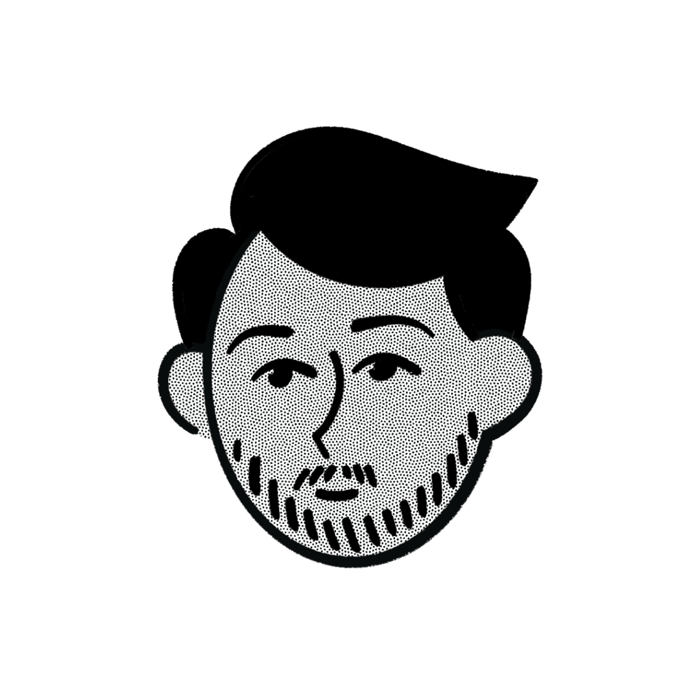

<br/>
<div align="center">
  
  <h1 align="center" style="color: #00ff99; font-size: 3rem;">Portfólio Vini</h1>
  <p align="center">
    <strong>Um portfólio de desenvolvedor moderno e elegante, construído com as tecnologias mais recentes para uma experiência de usuário excepcional.</strong>
  </p>
  <p align="center">
    <a href="#-sobre-o-projeto">Sobre</a> •
    <a href="#-principais-recursos">Recursos</a> •
    <a href="#-design-e-estilo">Design</a> •
    <a href="#-tecnologias-utilizadas">Tecnologias</a> •
    <a href="#-como-executar">Executando</a>
  </p>
</div>

<div align="center">
  
</div>

---

## 🚀 Sobre o Projeto

Este projeto é a minha vitrine profissional, um espaço onde demonstro minhas habilidades em desenvolvimento de software e design de interfaces. O objetivo foi criar uma experiência digital fluida e visualmente impactante, que não só apresentasse meus trabalhos, mas que também fosse um projeto do qual me orgulhasse.

Inspirado em designs modernos, com um tema escuro (`#1c1c22`) e uma cor de destaque vibrante (`#00ff99`), o portfólio utiliza animações sofisticadas para guiar o usuário de forma intuitiva através das seções.

## ✨ Principais Recursos

- **🎨 Design Moderno:** Interface com tema escuro, tipografia `JetBrains Mono` e a cor de destaque `#00ff99` para uma estética profissional e tecnológica.
- **🎬 Animações Fluidas:** Transições de página suaves com `Framer Motion`, incluindo um efeito de escada (`Stairs`) e um pré-carregamento elegante.
- **🖼️ Elementos Interativos:** Componentes como o círculo animado ao redor da foto, contadores de estatísticas (`CountUp`) e um carrossel de projetos (`Swiper`) tornam a navegação mais dinâmica.
- **📱 Totalmente Responsivo:** Design que se adapta perfeitamente a qualquer tamanho de tela, do desktop ao mobile.
- **📂 Seções Completas:** Apresenta seções como Serviços, Resumo, Projetos e Contato, oferecendo uma visão completa do meu perfil profissional.
- **💼 Componentes Reutilizáveis:** Construído com `shadcn/ui` e `Radix UI`, garantindo componentes de alta qualidade, acessíveis e personalizáveis.

## 🎨 Design e Estilo

A identidade visual foi um dos pilares deste projeto. A paleta de cores foi escolhida para transmitir seriedade e modernidade, com um toque de ousadia.

- **Cor Primária (Fundo):** `#1c1c22`
- **Cor de Destaque (Accent):** `#00ff99`
- **Fonte Principal:** `JetBrains Mono`

As animações foram criadas com `Framer Motion` para não serem apenas um detalhe, mas parte fundamental da experiência, como pode ser visto nos arquivos `StairTransition.jsx` e `Photo.jsx`. O círculo animado, por exemplo, usa a técnica `strokeDasharray` para criar um efeito de movimento contínuo e hipnotizante.

## 🛠️ Tecnologias Utilizadas

Este projeto foi construído utilizando um ecossistema moderno de desenvolvimento web:

- **Next.js:** Framework React para renderização no lado do servidor e geração de sites estáticos.
- **React:** Biblioteca para construir interfaces de usuário.
- **Tailwind CSS:** Framework CSS utility-first para estilização rápida e customizável.
- **Framer Motion:** Biblioteca de animação para criar transições complexas e fluidas.
- **shadcn/ui:** Coleção de componentes de UI reutilizáveis.
- **Swiper.js:** Carrossel moderno para projetos e depoimentos.
- **React CountUp:** Para animar números e estatísticas de forma dinâmica.
- **Lucide & React Icons:** Para uma vasta gama de ícones SVG.

<div align="center">
  
  
  
  
</div>

## ⚙️ Como Executar

Para executar este projeto localmente, siga os passos abaixo:

```bash
# 1. Clone o repositório
git clone [https://github.com/seu-usuario/portfolio_vini.git](https://github.com/seu-usuario/portfolio_vini.git)

# 2. Navegue até o diretório do projeto
cd portfolio_vini

# 3. Instale as dependências
npm install

# 4. Inicie o servidor de desenvolvimento
npm run dev
```

Abra [http://localhost:3000](http://localhost:3000) no seu navegador para ver o resultado.

---
<p align="center">
  Feito com 💚 por Vinicius Penedo
</p>
